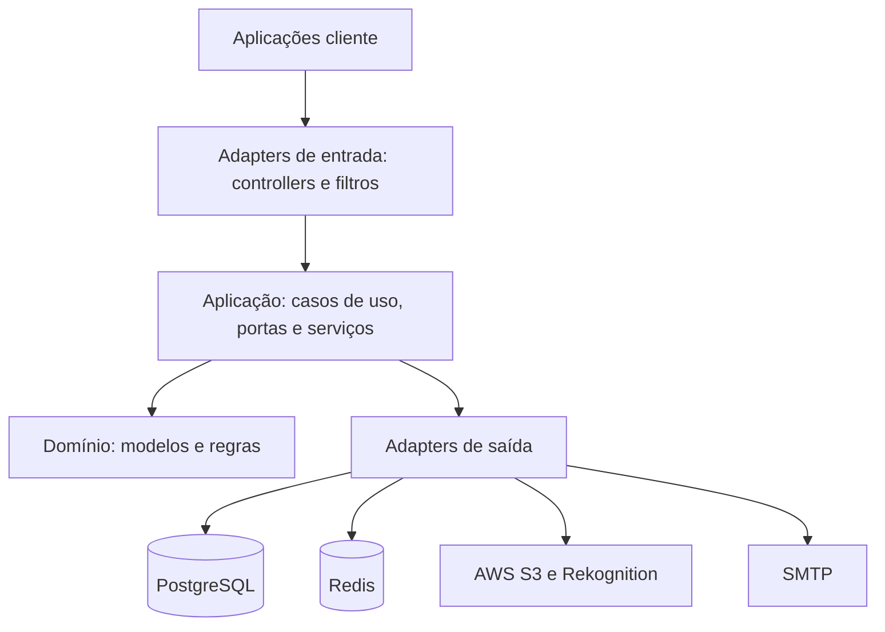

# Kronos Tech Solutions — Back-end

[](https://github.com/LsaBarbosa/Kronos-Tech-Solutions-KTS/actions/workflows/ci.yml)


API central da plataforma **Kronos**, uma solução multiempresa para gestão de jornada, pessoas, documentos, assinaturas eletrônicas, obrigações trabalhistas e privacidade de dados.

Este repositório concentra as regras de negócio, persistência, segurança, integrações externas e recursos operacionais consumidos pela aplicação web Kronos.

## Principais recursos

| Domínio | Recursos |
|---|---|
| Identidade e acesso | Login por senha ou reconhecimento facial, recuperação de senha, sessão via cookie HTTP-Only, CSRF, logout, troca de empresa e controle por papéis |
| Empresas e pessoas | Gestão de empresas, usuários, colaboradores, acesso multiempresa, ativação, inativação e operações administrativas |
| Jornada de trabalho | Registro de ponto, geolocalização, ajustes, aprovações, férias, abonos, registros recentes e relatórios |
| Documentos e assinaturas | Upload e download controlados, contratos de serviço, assinatura do espelho de ponto e geração de evidências |
| Legal e fiscal | AFD, AEJ, espelho de ponto, comprovantes e atestado técnico |
| LGPD e privacidade | Solicitações do titular, consentimento biométrico, exportação, anonimização, inventário de tratamento, retenção e trilha de auditoria |
| Segurança operacional | Registro e tratamento de incidentes, rate limiting, blacklist de tokens, validação de uploads e logs sanitizados |
| Comunicação e suporte | Avisos, entregas de mensagens, FAQ contextual, dashboard e captação pública de leads |
| Administração da plataforma | Saúde operacional, gestão global por CTO e ambiente de demonstração controlado |

## Arquitetura

O projeto segue uma organização inspirada em **Arquitetura Hexagonal**, separando domínio, casos de uso e detalhes de infraestrutura.



### Organização do código

```text
src/main/java/com/kts/kronos/
├── adapter/
│   ├── in/                 # Controllers, filtros e DTOs de entrada/saída
│   └── out/                # Persistência, segurança, storage e notificações
├── application/
│   ├── port/in/usecase/    # Contratos dos casos de uso
│   ├── port/out/           # Portas para infraestrutura
│   ├── service/            # Orquestração das regras de negócio
│   └── scheduler/          # Rotinas agendadas
├── domain/                 # Modelos, enums e regras centrais
├── config/                 # Segurança e configuração técnica
├── infrastructure/         # Implementações de apoio e Redis
└── observability/          # Métricas, tracing, logs e correlação

src/main/resources/
├── db/migration/           # Migrations versionadas do Flyway
├── application.yml
├── application-local.yml
├── application-prod.yml
└── application-observability.yml
```

## Stack tecnológica

| Categoria | Tecnologias |
|---|---|
| Linguagem e runtime | Java 21 |
| Framework | Spring Boot 3.5, Spring MVC, WebFlux, Validation e Integration |
| Segurança | Spring Security, JWT, BCrypt, cookie HTTP-Only, CSRF e autorização por papéis |
| Persistência | PostgreSQL, Spring Data JPA, Hibernate e Flyway |
| Cache e coordenação | Redis |
| Cloud | AWS S3 e AWS Rekognition |
| Documentos | iText e Bouncy Castle |
| API | REST e OpenAPI/Swagger |
| Observabilidade | Actuator, Micrometer, Prometheus, OpenTelemetry, Tempo, Loki, Promtail e Grafana |
| Testes | JUnit 5, Mockito, Spring Security Test, H2, Testcontainers e JaCoCo |
| Segurança de dependências | Gitleaks, Trivy, CodeQL, OSV-Scanner e OWASP Dependency-Check |
| Build | Gradle Wrapper |

## Pré-requisitos

- JDK 21;
- PostgreSQL;
- Docker, quando forem utilizados Redis, Testcontainers ou a stack de observabilidade;
- acesso aos serviços AWS e SMTP para validar os fluxos que dependem dessas integrações.

Não é necessário instalar o Gradle globalmente: o repositório inclui o Gradle Wrapper.

## Execução local

### 1. Obtenha o projeto

```bash
git clone https://github.com/LsaBarbosa/Kronos-Tech-Solutions-KTS.git
cd Kronos-Tech-Solutions-KTS
git switch VPS_PRODUCTION_KRONOS_V1
```

### 2. Prepare o PostgreSQL

O profile `local` usa, por padrão, o banco e o usuário `kronos_local`.

```sql
CREATE USER kronos_local WITH PASSWORD 'kronos_local';
CREATE DATABASE kronos_local OWNER kronos_local;
```

Para usar outra configuração, defina `DB_HOST`, `DB_PORT`, `DB_NAME`, `DB_USERNAME` e `DB_PASSWORD`.

### 3. Inicie a aplicação

```bash
SPRING_PROFILES_ACTIVE=local ./gradlew bootRun
```

O Flyway valida e aplica automaticamente as migrations versionadas durante a inicialização.

### 4. Verifique o ambiente

| Recurso | Endereço local |
|---|---|
| API | `http://localhost:8080` |
| Health check | `http://localhost:8080/actuator/health` |
| Swagger UI | `http://localhost:8080/swagger-ui.html` |
| OpenAPI | `http://localhost:8080/v3/api-docs` |

Swagger e OpenAPI ficam habilitados no profile `local` e desabilitados por padrão em produção.

## Redis local

O Redis é opcional no desenvolvimento, mas necessário para validar cache, rate limiting, locks distribuídos e outros fluxos coordenados.

```bash
export REDIS_PASSWORD='defina-uma-senha-local'
docker compose up -d

export KRONOS_REDIS_ENABLED=true
export REDIS_HOST=localhost
export REDIS_PORT=6379
```

Use o mesmo valor de `REDIS_PASSWORD` ao iniciar a aplicação. Para encerrar:

```bash
docker compose down
```

## Configuração

O arquivo [`.env.example`](.env.example) documenta as variáveis disponíveis. Ele é apenas um modelo: o Spring Boot não carrega arquivos `.env` automaticamente. Exporte as variáveis no shell ou configure-as no serviço responsável pela execução da aplicação.

### Variáveis essenciais em produção

| Grupo | Variáveis principais |
|---|---|
| Aplicação | `SPRING_PROFILES_ACTIVE`, `SERVER_PORT`, `SERVER_ADDRESS` |
| Banco de dados | `DB_HOST`, `DB_PORT`, `DB_NAME`, `DB_USERNAME`, `DB_PASSWORD` |
| Autenticação | `JWT_SECRET`, `JWT_EXPIRATION`, `AUTH_COOKIE_*` |
| Front-end e CORS | `FRONTEND_BASE_URL_*`, `FRONTEND_ALLOWED_ORIGINS` |
| Redis | `REDIS_HOST`, `REDIS_PORT`, `REDIS_PASSWORD`, `REDIS_KEY_HMAC_SECRET` |
| E-mail | `MAIL_HOST`, `MAIL_PORT`, `MAIL_USERNAME`, `MAIL_PASSWORD` |
| AWS | `AWS_REGION`, credenciais ou role da instância, buckets S3 e coleção do Rekognition |
| Biometria e assinatura | `SECRET_TERM`, `DIGITAL_CERTIFICATE_PATH`, `DIGITAL_CERTIFICATE_PASSWORD` |
| LGPD | `LGPD_LOG_HASH_SECRET`, opções do scheduler e autorização de aplicação da retenção |
| Uploads | `UPLOAD_MAX_BYTES`, `UPLOAD_ANTIVIRUS_*` |
| Observabilidade | `MANAGEMENT_*`, `OTEL_EXPORTER_OTLP_ENDPOINT` |

Segredos de produção não devem ser versionados, incluídos em imagens Docker ou expostos em logs.

### Profiles

| Profile | Finalidade |
|---|---|
| `local` | Desenvolvimento com configurações seguras para a máquina do desenvolvedor |
| `prod` | Produção, validações obrigatórias e integrações externas reais |
| `observability` | Complemento para métricas, tracing e logs estruturados |
| `test` | Execução automatizada com configurações isoladas |

## API

Os controllers expõem rotas sem um prefixo global. Os principais namespaces são:

| Namespace | Responsabilidade |
|---|---|
| `/auth` | Login, sessão, CSRF, recuperação de senha e troca de empresa |
| `/companies` | Empresas e operações administrativas |
| `/users` e `/employee` | Usuários, colaboradores, perfis e acessos |
| `/records` | Ponto, relatórios, ajustes, férias, abonos e assinaturas mensais |
| `/documents` | Upload, consulta, download e exclusão de documentos |
| `/service-contracts` | Contratos, distribuição e assinaturas |
| `/legal` | AFD, AEJ, espelho de ponto e documentos técnicos |
| `/lgpd` e `/admin/retention` | Direitos do titular, inventário, anonimização e retenção |
| `/terms` e `/public/privacy` | Consentimento, política e catálogo público de tratamento |
| `/messages` e `/faqs` | Avisos e conteúdo de suporte |
| `/security-incidents` | Gestão de incidentes de segurança |
| `/admin/platform` | Indicadores operacionais restritos |

No ambiente local, consulte o Swagger para o contrato detalhado, parâmetros e respostas.

## Autenticação e segurança

- O JWT é entregue em cookie HTTP-Only; clientes web não devem persistir o token em `localStorage`.
- Requisições que alteram estado utilizam proteção CSRF. O token pode ser obtido por `GET /auth/csrf`.
- A autorização é aplicada no back-end por papéis `CTO`, `MANAGER` e `PARTNER`.
- CORS aceita somente as origens configuradas.
- Login, recuperação de senha e operações sensíveis possuem rate limiting.
- Tokens revogados são invalidados e sessões podem ser encerradas globalmente.
- Uploads têm limite de tamanho, validação e suporte a antivírus.
- Filtros e sanitizadores evitam registrar credenciais, dados biométricos e outros dados sensíveis.
- Ações críticas mantêm trilhas de auditoria.

Controles de interface não substituem a autorização aplicada pela API.

## Testes e qualidade

| Comando | Finalidade |
|---|---|
| `./gradlew test` | Executa a suíte padrão |
| `./gradlew unitTest` | Executa testes unitários sem testes JPA e de integração |
| `./gradlew dataJpaTest` | Executa testes de persistência com PostgreSQL/Testcontainers |
| `./gradlew clean check` | Compila, testa e verifica os limites de cobertura |
| `./gradlew jacocoTestReport` | Gera o relatório de cobertura |
| `./gradlew dependencyCheckAnalyze` | Analisa vulnerabilidades conhecidas nas dependências |
| `bash scripts/security/assert-no-secrets.sh` | Procura credenciais versionadas |
| `bash scripts/check-doc-links.sh` | Valida links relativos da documentação |

O pipeline principal também executa Gitleaks, Trivy, testes unitários, testes JPA e validações de documentação. Workflows adicionais cobrem CodeQL, OSV-Scanner, OWASP Dependency-Check e geração de SBOM.

## Observabilidade

A aplicação publica health checks, métricas Prometheus, logs correlacionados e traces OpenTelemetry. Em produção, os endpoints de management ficam em uma porta separada e vinculada ao loopback por padrão.

A stack de observabilidade pode ser iniciada com:

```bash
cd infra/observability
cp .env.example .env
docker compose up -d
```

O diretório inclui provisionamento de dashboards, alertas e datasources para Grafana, além de configurações de Prometheus, Loki, Promtail e Tempo.

## Build e deploy

### JAR

```bash
./gradlew clean bootJar
java -jar build/libs/kronos-0.0.1-SNAPSHOT.jar
```

### Imagem Docker

```bash
docker build -t kronos-backend .
```

A imagem executa com usuário não privilegiado e inicia o profile `prod`. As variáveis obrigatórias devem ser injetadas pelo ambiente de execução.

### VPS

O script [scripts/deploy.sh](scripts/deploy.sh) automatiza build, staging do JAR, backup, reinício do serviço, health check e rollback:

```bash
./scripts/deploy.sh --backend
```

Os caminhos e nomes de serviço do script devem corresponder à VPS de destino. O arquivo [deploy/hostinger-nginx.conf](deploy/hostinger-nginx.conf) fornece uma referência de reverse proxy, headers de segurança e rate limiting.

## Documentação complementar

- [Configuração do Gitleaks](docs/security/GITLEAKS_SETUP.md)
- [Rate limiting](docs/security/RATE_LIMITING.md)
- [Riscos de segurança aceitos](docs/security/riscos-aceitos.md)
- [Infraestrutura de observabilidade](infra/observability/)

## Repositório relacionado

- [Kronos User Platform](https://github.com/LsaBarbosa/Kronos-Tech-Solution-User-Plataform/tree/VPS_PRODUCTION_KRONOS_V1) — aplicação web React que consome esta API.

## Colaboração

1. Crie uma branch a partir da base definida pelo time.
2. Não versione segredos, certificados, dumps ou arquivos de ambiente reais.
3. Preserve a separação entre domínio, aplicação, portas e adapters.
4. Adicione ou atualize testes para cada regra alterada.
5. Execute `./gradlew clean check` e as verificações de segurança antes de publicar.
6. Documente mudanças de contrato que afetem o front-end.

## Licença e uso

Não há licença pública associada a este repositório. O código é proprietário e seu uso, distribuição ou reutilização depende de autorização expressa da Kronos Tech Solutions.
