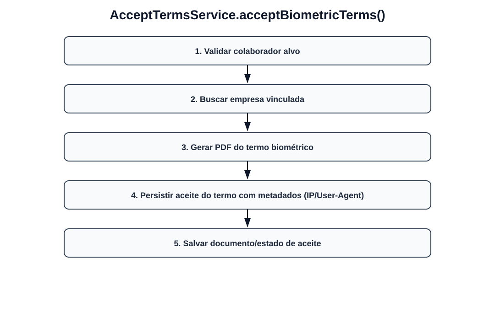
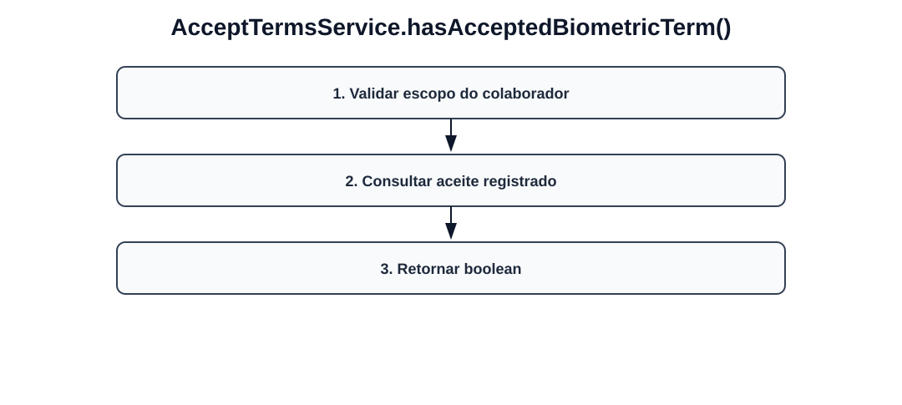

# Fluxos visuais — AcceptTermsService

Fluxo por método com imagem dedicada para cada operação do serviço.

## `acceptBiometricTerms`

- Validar colaborador alvo.
- Buscar empresa vinculada.
- Gerar PDF do termo biométrico.
- Persistir aceite do termo com metadados (IP/User-Agent).
- Salvar documento/estado de aceite.

## `hasAcceptedBiometricTerm`

- Validar escopo do colaborador.
- Consultar aceite registrado.
- Retornar boolean.
