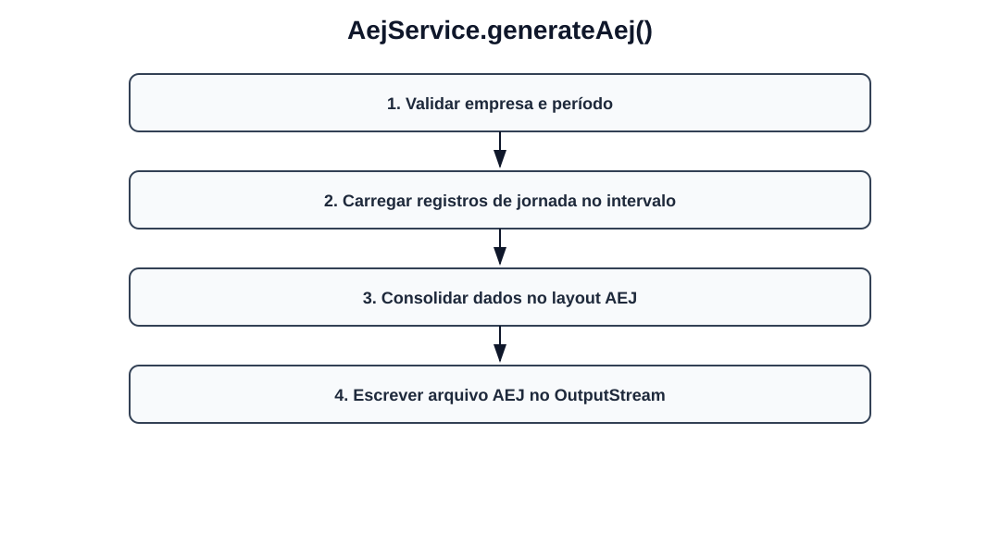

# Fluxos visuais — AejService

Fluxo por método com imagem dedicada para cada operação do serviço.

## `generateAej`

- Validar empresa e período.
- Carregar registros de jornada no intervalo.
- Consolidar dados no layout AEJ.
- Escrever arquivo AEJ no OutputStream.
