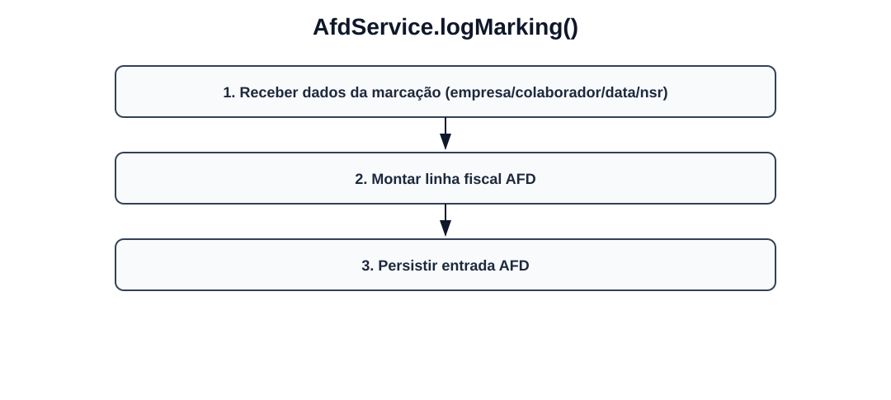
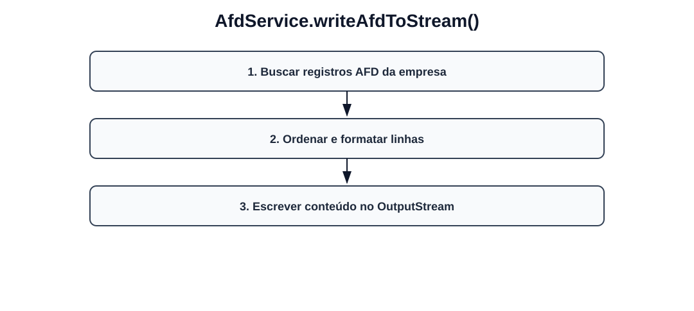

# Fluxos visuais — AfdService

Fluxo por método com imagem dedicada para cada operação do serviço.

## `logMarking`

- Receber dados da marcação (empresa/colaborador/data/nsr).
- Montar linha fiscal AFD.
- Persistir entrada AFD.

## `writeAfdToStream`

- Buscar registros AFD da empresa.
- Ordenar e formatar linhas.
- Escrever conteúdo no OutputStream.
