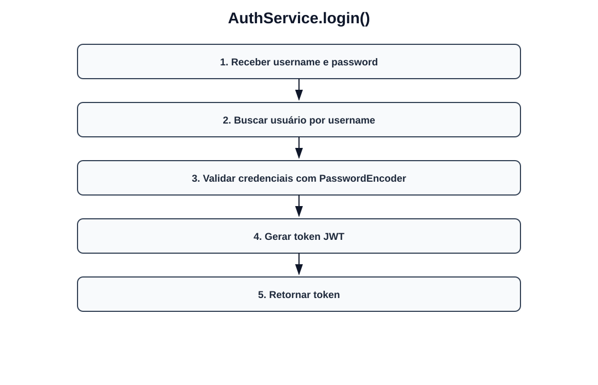
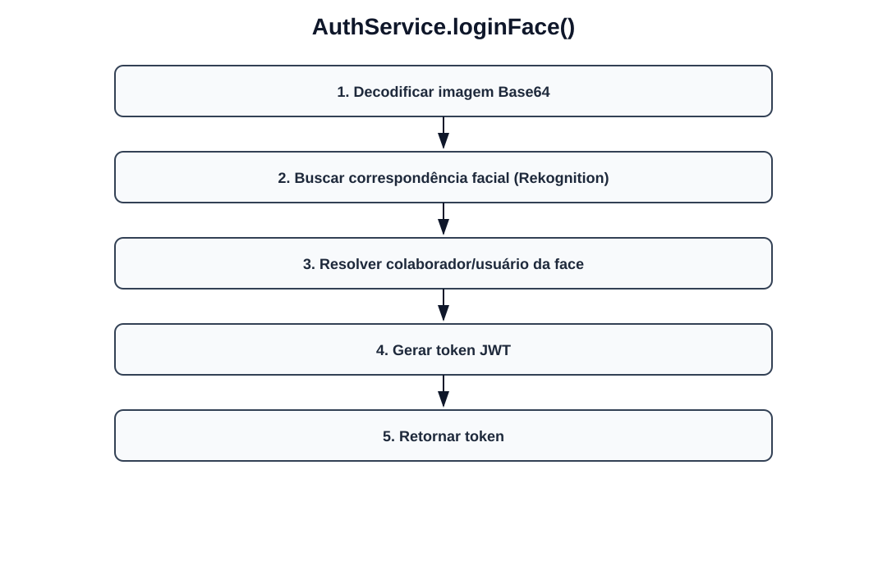
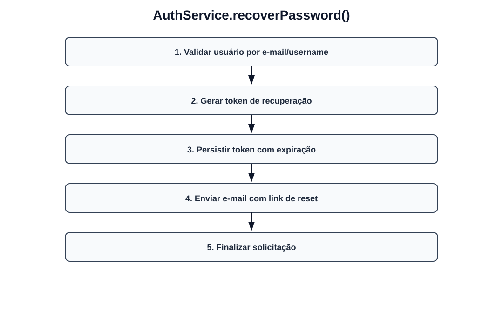
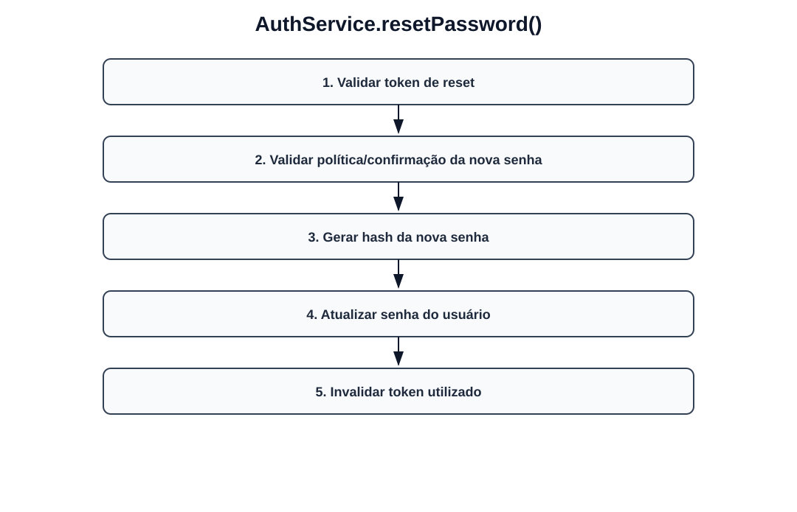

# Fluxos visuais — AuthService

Fluxo por método com imagem dedicada para cada operação do serviço.

## `login`

- Receber username e password.
- Buscar usuário por username.
- Validar credenciais com PasswordEncoder.
- Gerar token JWT.
- Retornar token.

## `loginFace`

- Decodificar imagem Base64.
- Buscar correspondência facial (Rekognition).
- Resolver colaborador/usuário da face.
- Gerar token JWT.
- Retornar token.

## `recoverPassword`

- Validar usuário por e-mail/username.
- Gerar token de recuperação.
- Persistir token com expiração.
- Enviar e-mail com link de reset.
- Finalizar solicitação.

## `resetPassword`

- Validar token de reset.
- Validar política/confirmação da nova senha.
- Gerar hash da nova senha.
- Atualizar senha do usuário.
- Invalidar token utilizado.
