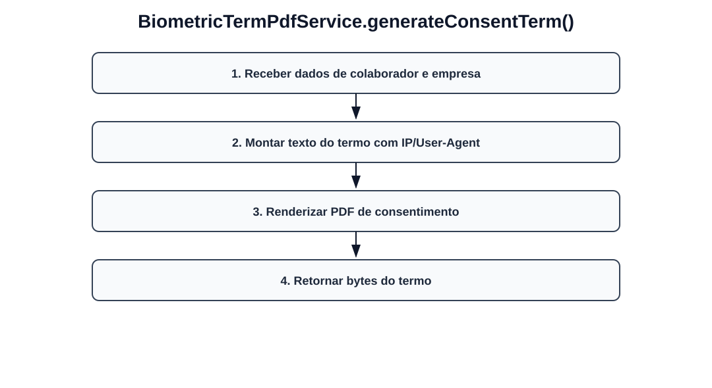

# Fluxos visuais — BiometricTermPdfService

Fluxo por método com imagem dedicada para cada operação do serviço.

## `generateConsentTerm`

- Receber dados de colaborador e empresa.
- Montar texto do termo com IP/User-Agent.
- Renderizar PDF de consentimento.
- Retornar bytes do termo.
