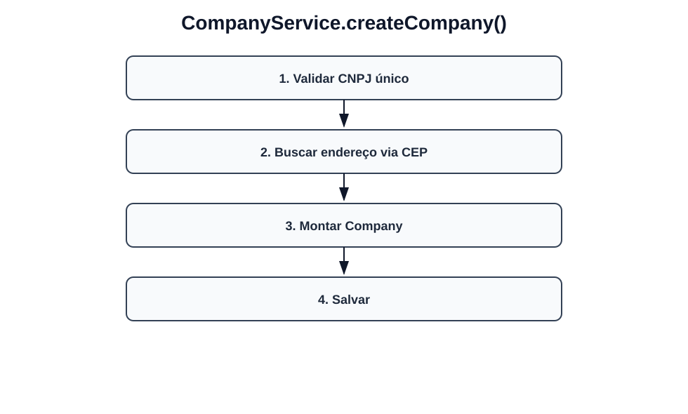
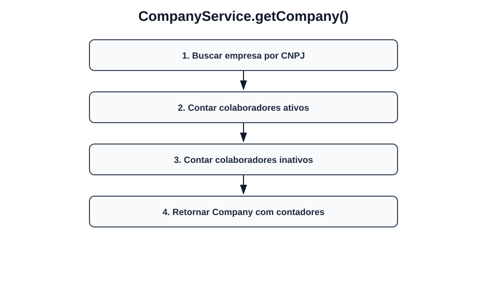
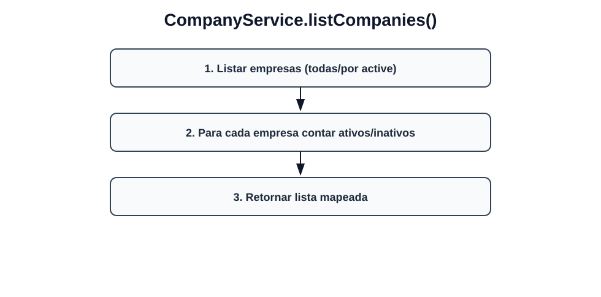
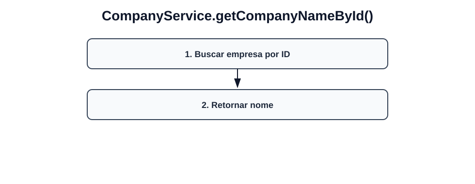
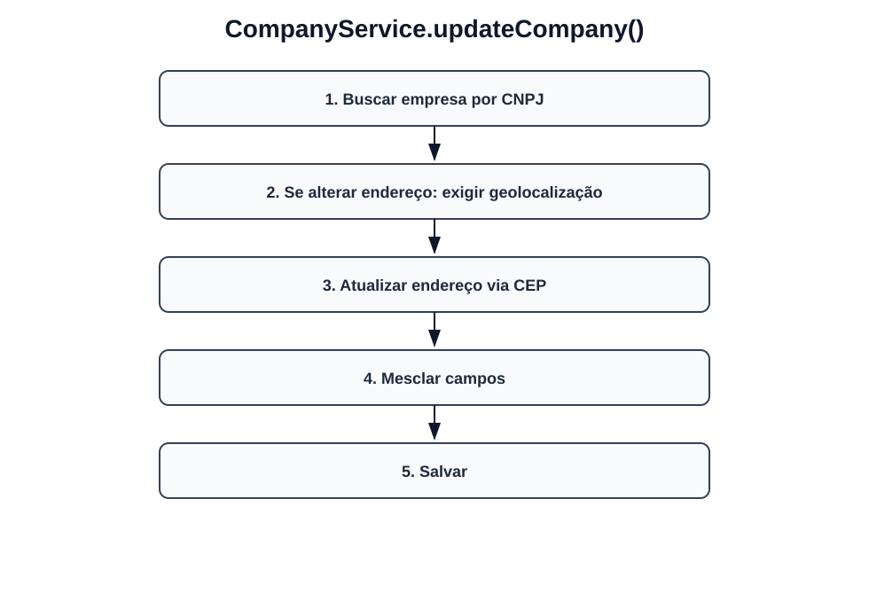
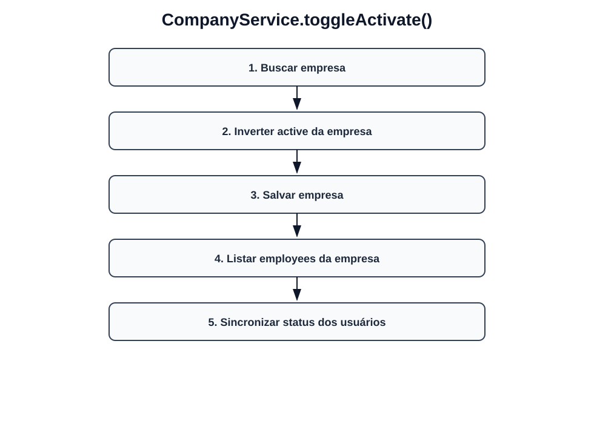
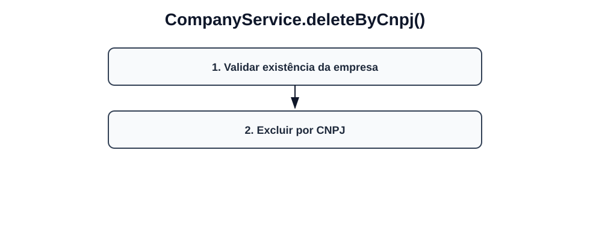
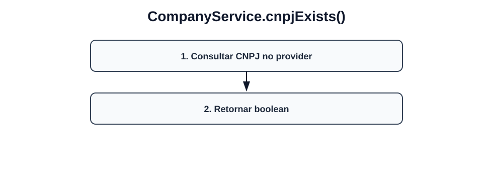

# Fluxos visuais — CompanyService

Fluxo por método com imagem dedicada para cada operação do serviço.

## `createCompany`

- Validar CNPJ único.
- Buscar endereço via CEP.
- Montar Company.
- Salvar.

## `getCompany`

- Buscar empresa por CNPJ.
- Contar colaboradores ativos.
- Contar colaboradores inativos.
- Retornar Company com contadores.

## `listCompanies`

- Listar empresas (todas/por active).
- Para cada empresa contar ativos/inativos.
- Retornar lista mapeada.

## `getCompanyNameById`

- Buscar empresa por ID.
- Retornar nome.

## `updateCompany`

- Buscar empresa por CNPJ.
- Se alterar endereço: exigir geolocalização.
- Atualizar endereço via CEP.
- Mesclar campos.
- Salvar.

## `toggleActivate`

- Buscar empresa.
- Inverter active da empresa.
- Salvar empresa.
- Listar employees da empresa.
- Sincronizar status dos usuários.

## `deleteByCnpj`

- Validar existência da empresa.
- Excluir por CNPJ.

## `cnpjExists`

- Consultar CNPJ no provider.
- Retornar boolean.
