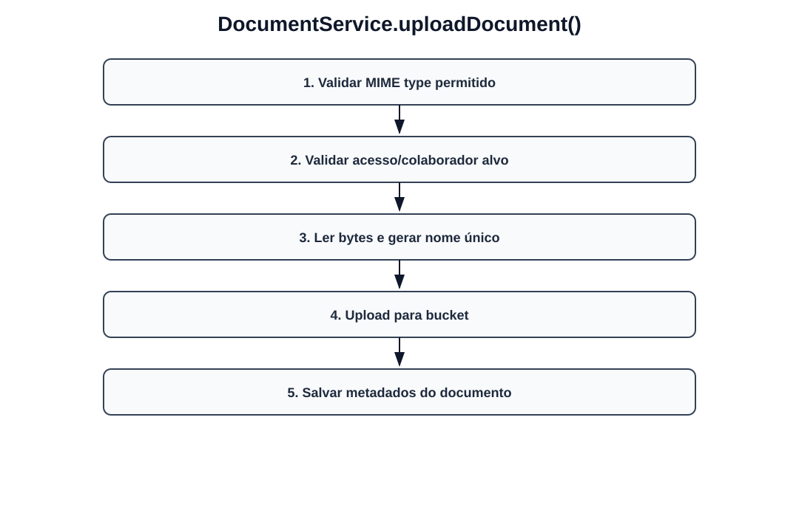
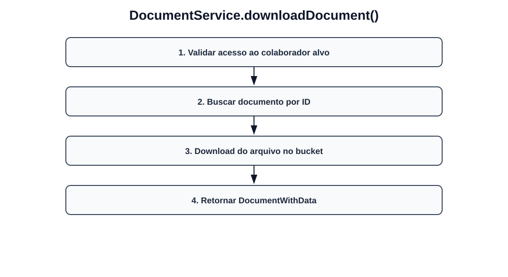
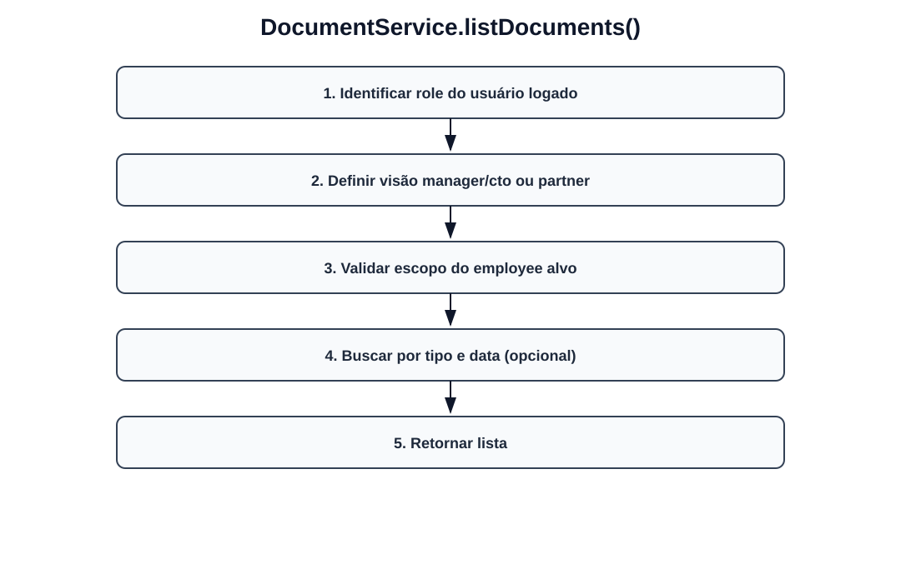
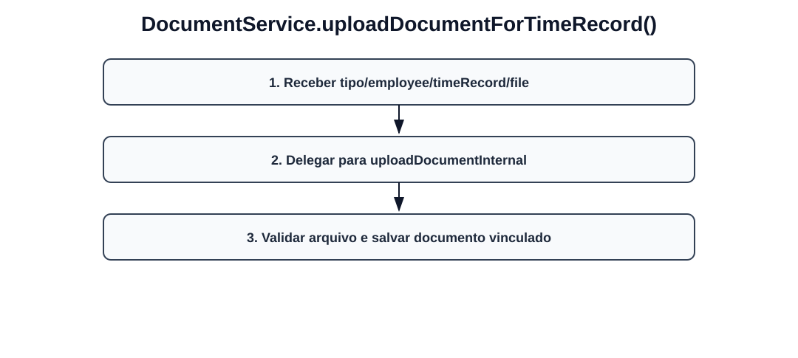
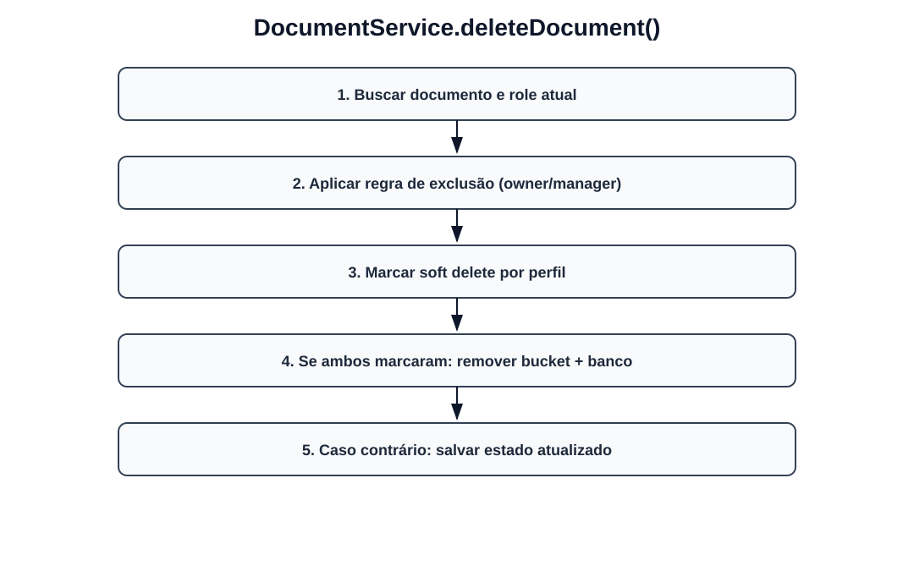
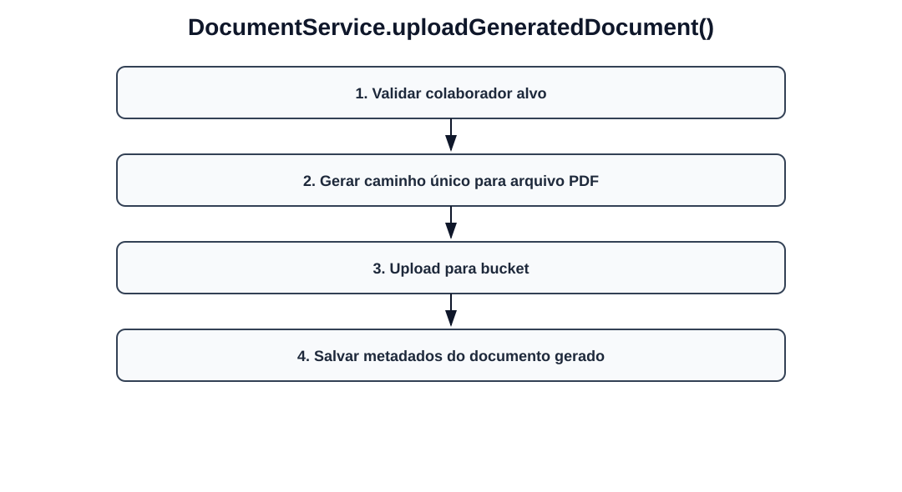

# Fluxos visuais — DocumentService

Fluxo por método com imagem dedicada para cada operação do serviço.

## `uploadDocument`

- Validar MIME type permitido.
- Validar acesso/colaborador alvo.
- Ler bytes e gerar nome único.
- Upload para bucket.
- Salvar metadados do documento.

## `downloadDocument`

- Validar acesso ao colaborador alvo.
- Buscar documento por ID.
- Download do arquivo no bucket.
- Retornar DocumentWithData.

## `listDocuments`

- Identificar role do usuário logado.
- Definir visão manager/cto ou partner.
- Validar escopo do employee alvo.
- Buscar por tipo e data (opcional).
- Retornar lista.

## `uploadDocumentForTimeRecord`

- Receber tipo/employee/timeRecord/file.
- Delegar para uploadDocumentInternal.
- Validar arquivo e salvar documento vinculado.

## `deleteDocument`

- Buscar documento e role atual.
- Aplicar regra de exclusão (owner/manager).
- Marcar soft delete por perfil.
- Se ambos marcaram: remover bucket + banco.
- Caso contrário: salvar estado atualizado.

## `uploadGeneratedDocument`

- Validar colaborador alvo.
- Gerar caminho único para arquivo PDF.
- Upload para bucket.
- Salvar metadados do documento gerado.
