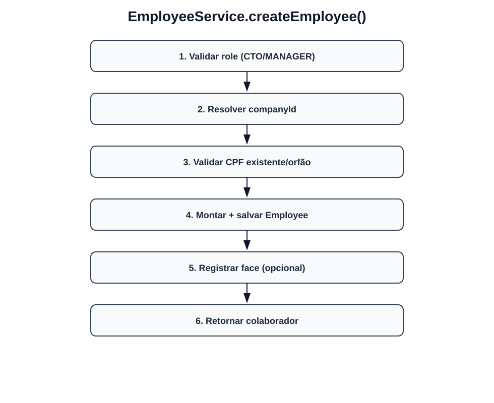
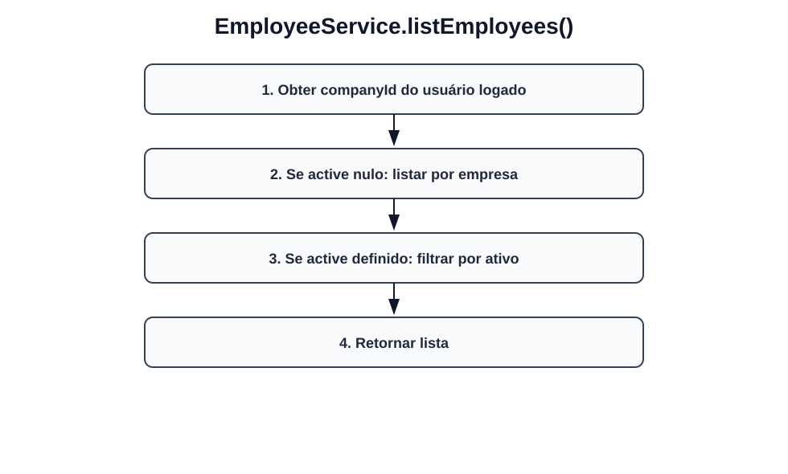
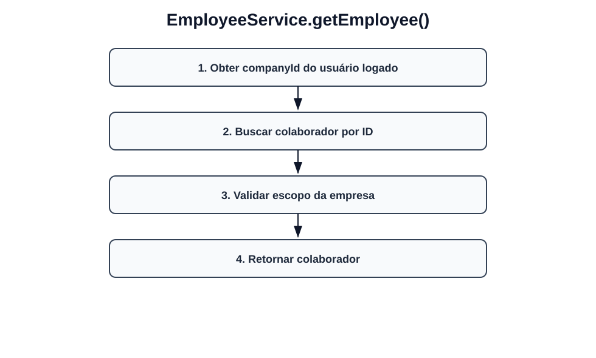
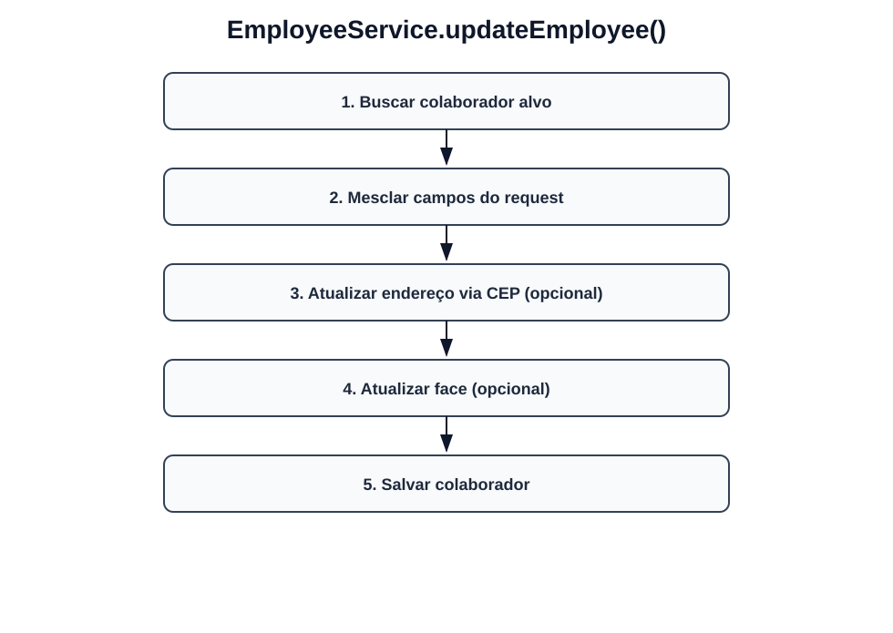
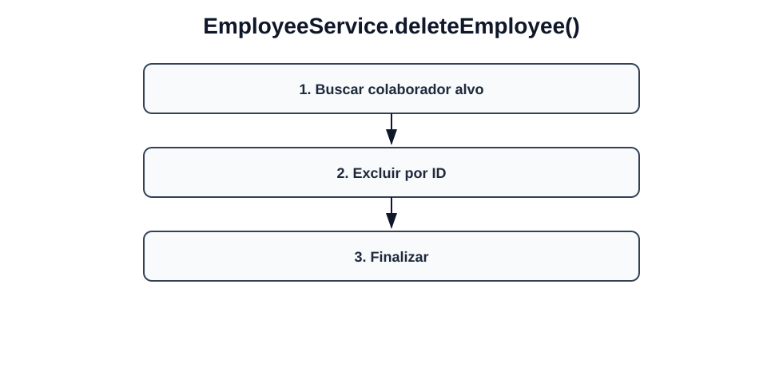
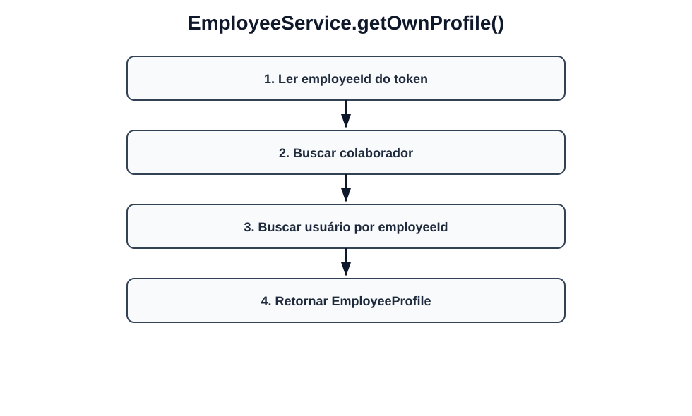
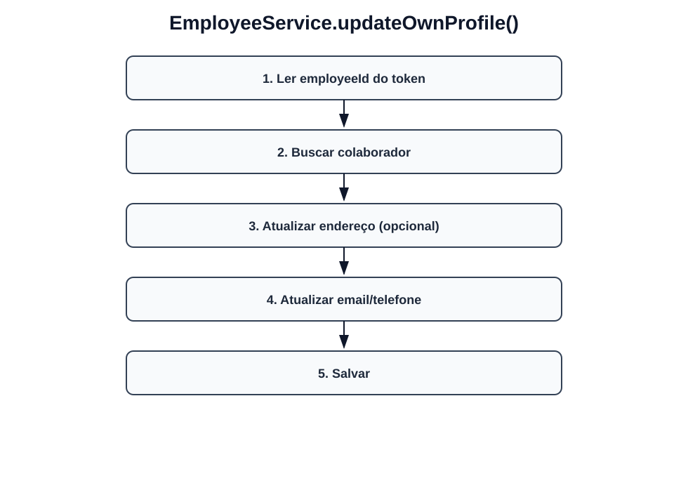
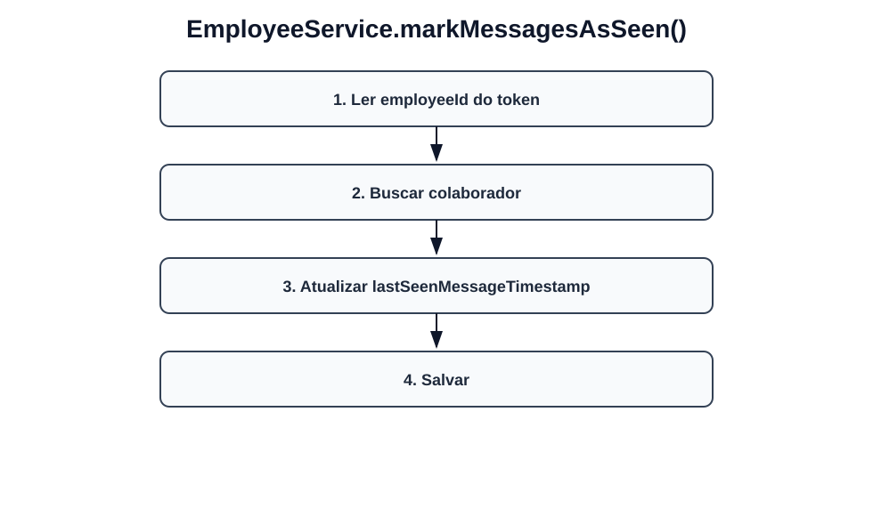
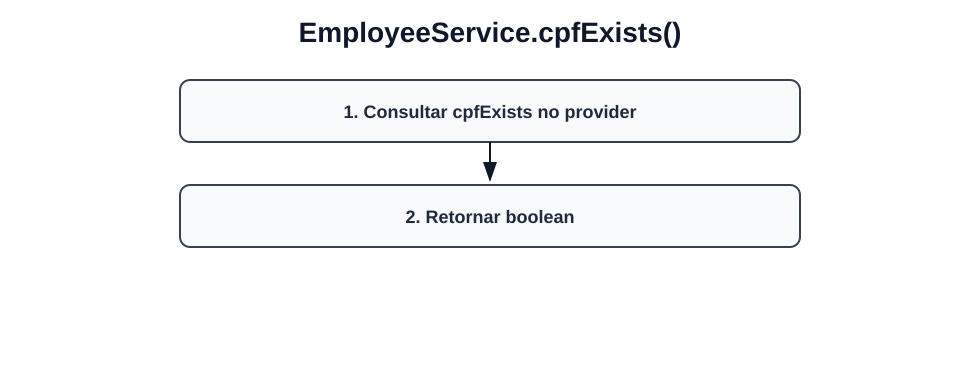
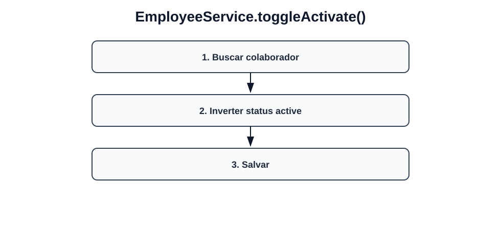

# Fluxos visuais — EmployeeService

Fluxo por método com imagem dedicada para cada operação do serviço.

## `createEmployee`

- Validar role (CTO/MANAGER).
- Resolver companyId.
- Validar CPF existente/orfão.
- Montar + salvar Employee.
- Registrar face (opcional).
- Retornar colaborador.

## `listEmployees`

- Obter companyId do usuário logado.
- Se active nulo: listar por empresa.
- Se active definido: filtrar por ativo.
- Retornar lista.

## `getEmployee`

- Obter companyId do usuário logado.
- Buscar colaborador por ID.
- Validar escopo da empresa.
- Retornar colaborador.

## `updateEmployee`

- Buscar colaborador alvo.
- Mesclar campos do request.
- Atualizar endereço via CEP (opcional).
- Atualizar face (opcional).
- Salvar colaborador.

## `deleteEmployee`

- Buscar colaborador alvo.
- Excluir por ID.
- Finalizar.

## `getOwnProfile`

- Ler employeeId do token.
- Buscar colaborador.
- Buscar usuário por employeeId.
- Retornar EmployeeProfile.

## `updateOwnProfile`

- Ler employeeId do token.
- Buscar colaborador.
- Atualizar endereço (opcional).
- Atualizar email/telefone.
- Salvar.

## `markMessagesAsSeen`

- Ler employeeId do token.
- Buscar colaborador.
- Atualizar lastSeenMessageTimestamp.
- Salvar.

## `cpfExists`

- Consultar cpfExists no provider.
- Retornar boolean.

## `toggleActivate`

- Buscar colaborador.
- Inverter status active.
- Salvar.
