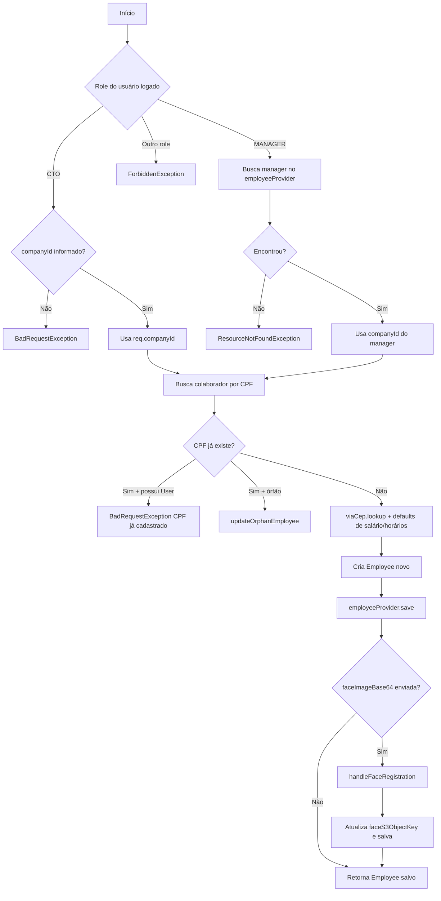
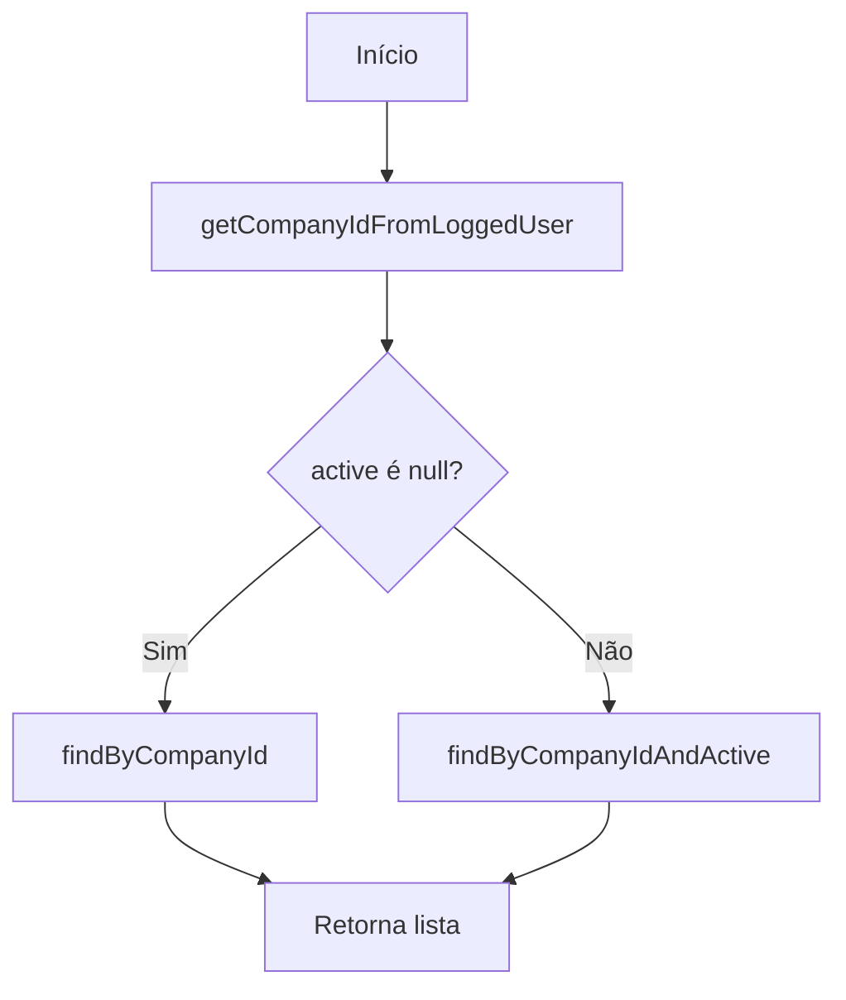
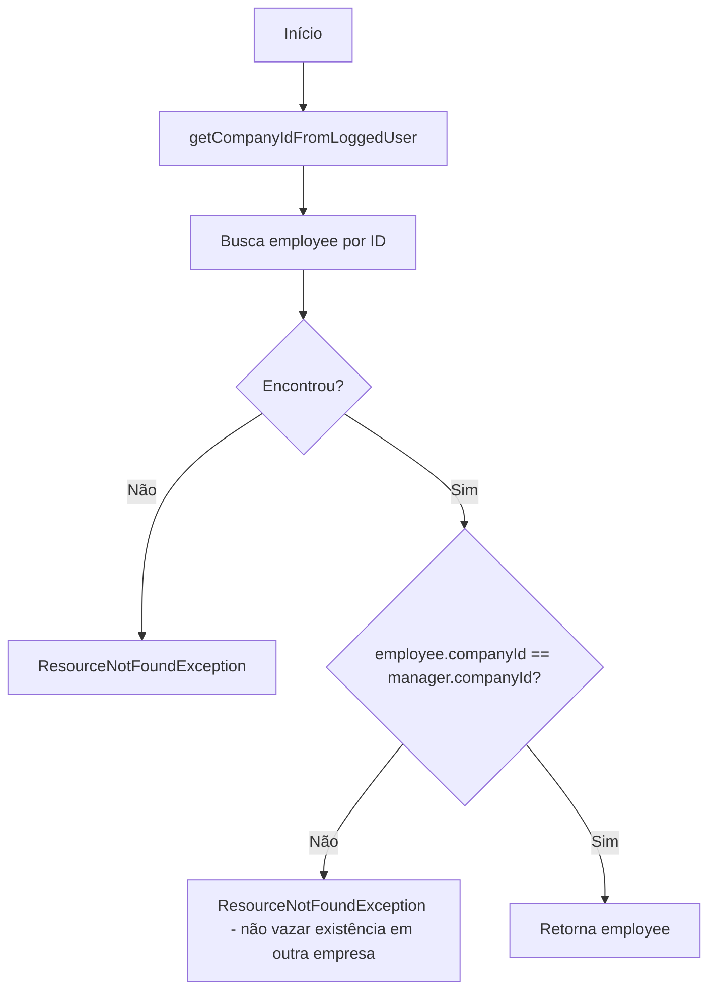
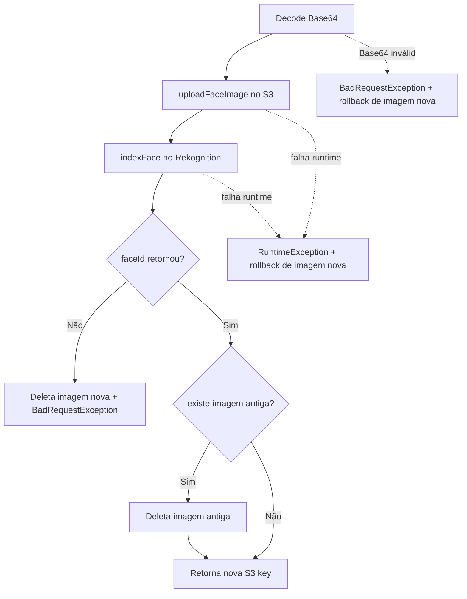
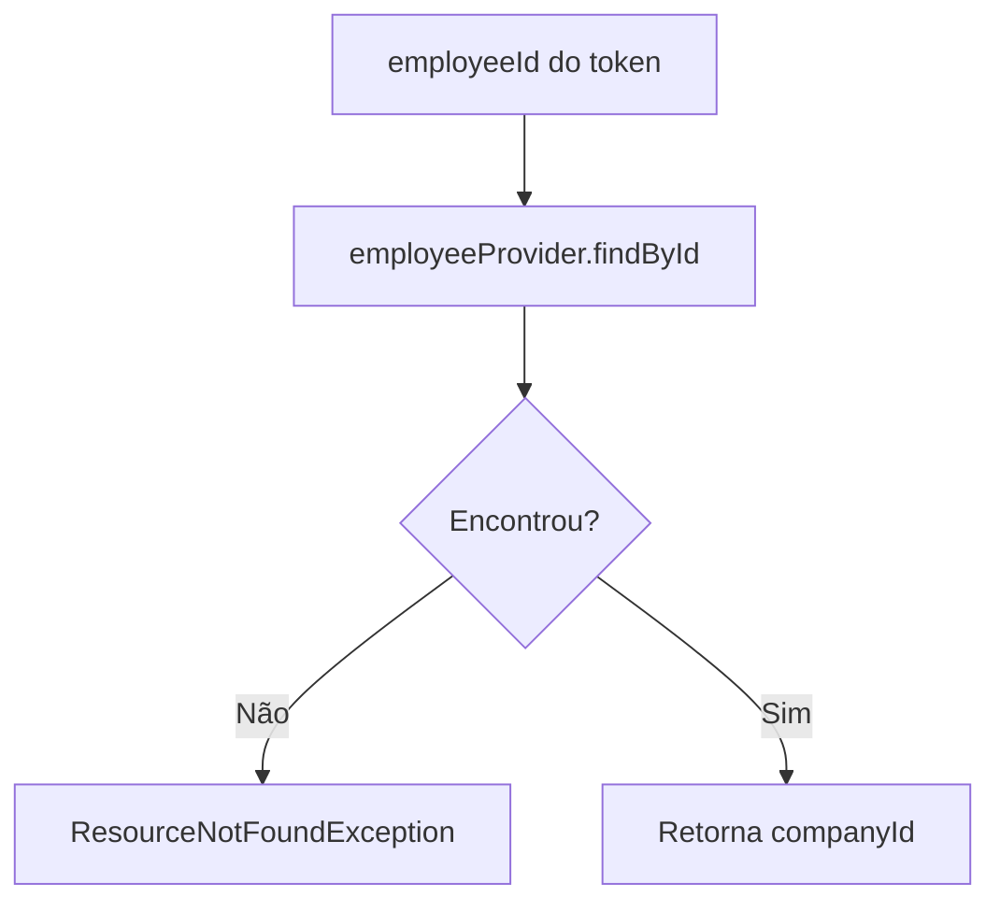
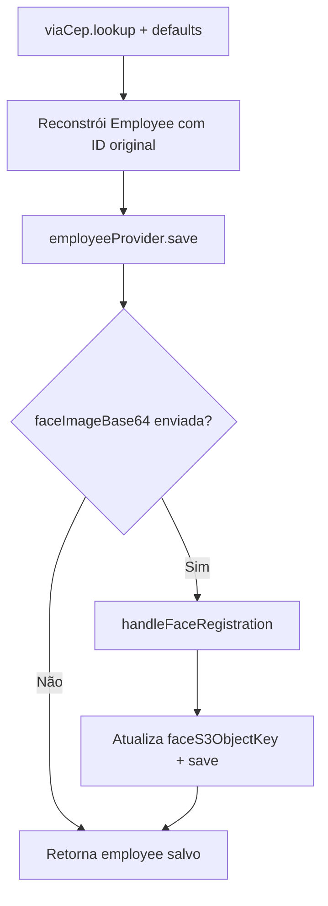

# Fluxos do `EmployeeService` (método a método)

Este documento detalha o fluxo de **cada método de serviço** da classe `EmployeeService`.

## 1) `createEmployee(CreateEmployeeRequest req)`



## 2) `listEmployees(Boolean active)`



## 3) `getEmployee(UUID employeeId)`



## 4) `updateEmployee(UUID id, UpdateEmployeeManagerRequest req)`

```mermaid
flowchart TD
    A[Início] --> B[getEmployee(id)]
    B --> C[Reconstrói Employee com merge req x atual]
    C --> D{req.address != null?}
    D -->|Sim| E[viaCep.lookup + withNumber]
    D -->|Não| F[Segue]
    E --> F
    F --> G{req.faceImageBase64 preenchida?}
    G -->|Sim| H[handleFaceRegistration]
    G -->|Não| I[Mantém chave S3 atual]
    H --> J[Atualiza faceS3ObjectKey]
    I --> J
    J --> K[employeeProvider.save]
```

## 5) `deleteEmployee(UUID id)`

```mermaid
flowchart TD
    A[Início] --> B[getEmployee(id)]
    B --> C[employeeProvider.deleteById]
    C --> D[Fim]
```

## 6) `getOwnProfile()`

```mermaid
flowchart TD
    A[Início] --> B[Obtém employeeId do token]
    B --> C[getEmployee(employeeId)]
    C --> D[userProvider.findByEmployeeId]
    D --> E{Encontrou user?}
    E -->|Não| F[ResourceNotFoundException]
    E -->|Sim| G[Retorna EmployeeProfile(employee + role)]
```

## 7) `updateOwnProfile(UpdateEmployeePartnerRequest req)`

```mermaid
flowchart TD
    A[Início] --> B[employeeId do token]
    B --> C[getEmployee(employeeId)]
    C --> D{req.address != null?}
    D -->|Sim| E[viaCep.lookup + withNumber]
    D -->|Não| F[Usa endereço atual]
    E --> G[withEmail/withPhone/withAddress]
    F --> G
    G --> H[employeeProvider.save]
```

## 8) `markMessagesAsSeen()`

```mermaid
flowchart TD
    A[Início] --> B[employeeId do token]
    B --> C[findById(employeeId)]
    C --> D{Encontrou?}
    D -->|Não| E[ResourceNotFoundException]
    D -->|Sim| F[withLastSeenMessageTimestamp(now)]
    F --> G[employeeProvider.save]
```

## 9) `cpfExists(String cpf)`

```mermaid
flowchart TD
    A[Início] --> B[employeeProvider.cpfExists(cpf)]
    B --> C[Retorna boolean]
```

## 10) `toggleActivate(UUID employeeId)`

```mermaid
flowchart TD
    A[Início] --> B[getEmployee(employeeId)]
    B --> C[newStatus = !employee.active]
    C --> D[withActive(newStatus)]
    D --> E[employeeProvider.save]
```

---

## Fluxos auxiliares importantes

### A) `handleFaceRegistration(...)`



### B) `getCompanyIdFromLoggedUser()`



### C) `updateOrphanEmployee(...)`


