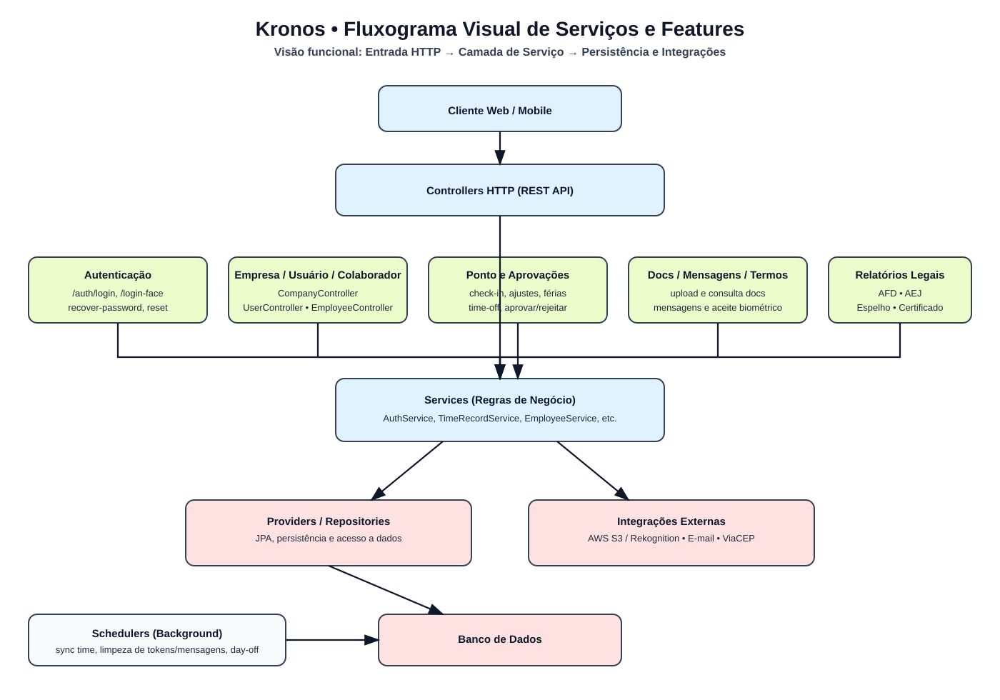

# Fluxograma visual de serviços e features do Kronos

Segue o fluxograma visual consolidado da arquitetura funcional do sistema:

## Leitura rápida

- **Entrada**: Cliente Web/Mobile chama os endpoints REST.
- **Orquestração**: Controllers encaminham para os Services.
- **Domínio**: Services aplicam regras de negócio por feature.
- **Saída**:
  - Providers/Repositories para persistência no banco.
  - Integrações externas (AWS S3/Rekognition, e-mail, ViaCEP).
- **Background**: Schedulers executam rotinas recorrentes (sincronismo e limpezas).

## Features cobertas no fluxograma

1. Autenticação e acesso (`/auth/*`).
2. Gestão de empresa, usuários e colaboradores.
3. Ponto e aprovações (check-in, ajustes, férias, folgas).
4. Documentos, mensagens e termos.
5. Relatórios legais (AFD, AEJ, espelho de ponto, certificado técnico).

## Detalhamento do EmployeeService

- Para ver o fluxo método a método do serviço de colaboradores, acesse: [Fluxos do EmployeeService](./fluxo-employee-service.md).

## Fluxos detalhados por serviço

- [Fluxos do EmployeeService](./employee-service-flows.md)
- [Fluxos do UserService](./user-service-flows.md)
- [Fluxos do CompanyService](./company-service-flows.md)
- [Fluxos do TimeRecordService](./time-record-service-flows.md)
- [Fluxos do MessageService](./message-service-flows.md)
- [Fluxos do DocumentService](./document-service-flows.md)

- [Fluxos do AuthService](./auth-service-flows.md)
- [Fluxos do AcceptTermsService](./accept-terms-service-flows.md)
- [Fluxos do AfdService](./afd-service-flows.md)
- [Fluxos do AejService](./aej-service-flows.md)
- [Fluxos do NtpTimeService](./ntp-time-service-flows.md)
- [Fluxos do PointMirrorPdfService](./point-mirror-pdf-service-flows.md)
- [Fluxos do ReceiptPdfService](./receipt-pdf-service-flows.md)
- [Fluxos do TechnicalCertificateService](./technical-certificate-service-flows.md)
- [Fluxos do TechnicalCertificatePdfService](./technical-certificate-pdf-service-flows.md)
- [Fluxos do BiometricTermPdfService](./biometric-term-pdf-service-flows.md)