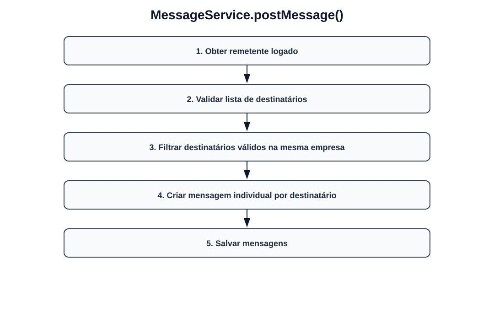
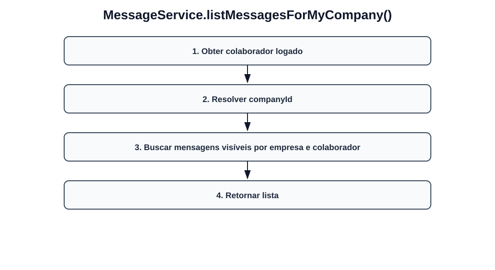
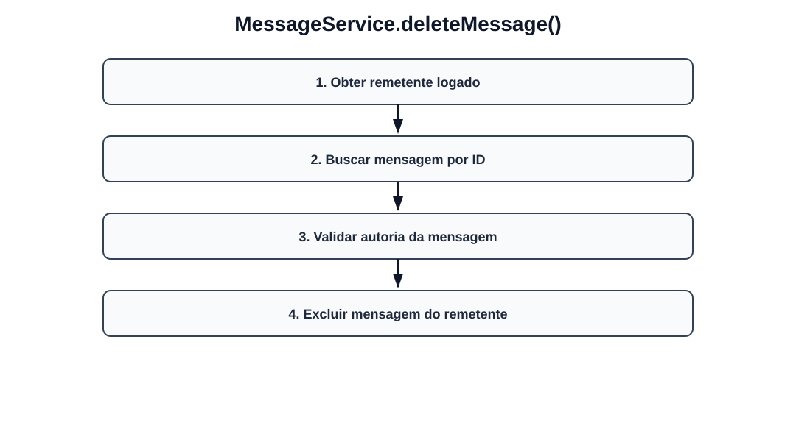

# Fluxos visuais — MessageService

Fluxo por método com imagem dedicada para cada operação do serviço.

## `postMessage`

- Obter remetente logado.
- Validar lista de destinatários.
- Filtrar destinatários válidos na mesma empresa.
- Criar mensagem individual por destinatário.
- Salvar mensagens.

## `listMessagesForMyCompany`

- Obter colaborador logado.
- Resolver companyId.
- Buscar mensagens visíveis por empresa e colaborador.
- Retornar lista.

## `deleteMessage`

- Obter remetente logado.
- Buscar mensagem por ID.
- Validar autoria da mensagem.
- Excluir mensagem do remetente.
