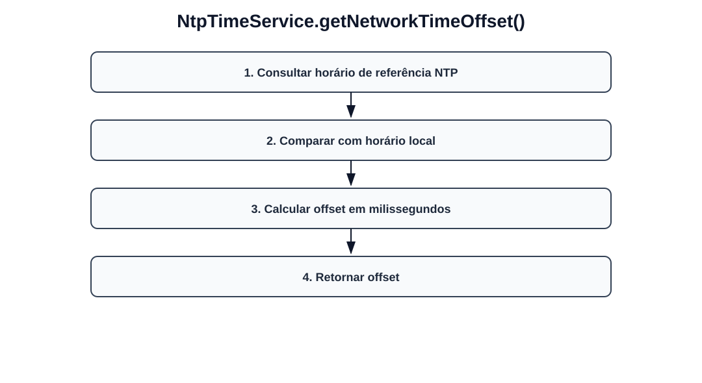
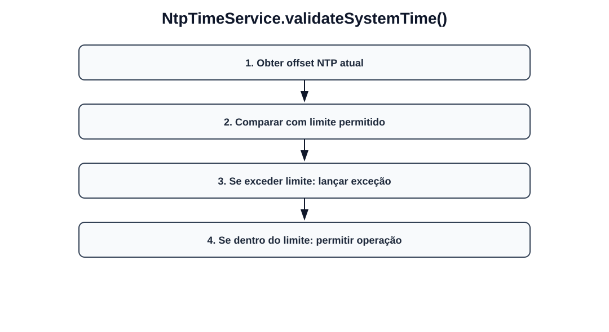

# Fluxos visuais — NtpTimeService

Fluxo por método com imagem dedicada para cada operação do serviço.

## `getNetworkTimeOffset`

- Consultar horário de referência NTP.
- Comparar com horário local.
- Calcular offset em milissegundos.
- Retornar offset.

## `validateSystemTime`

- Obter offset NTP atual.
- Comparar com limite permitido.
- Se exceder limite: lançar exceção.
- Se dentro do limite: permitir operação.
