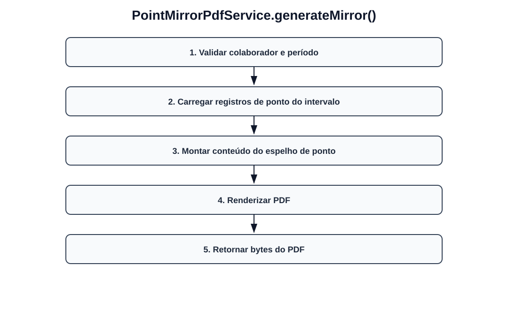

# Fluxos visuais — PointMirrorPdfService

Fluxo por método com imagem dedicada para cada operação do serviço.

## `generateMirror`

- Validar colaborador e período.
- Carregar registros de ponto do intervalo.
- Montar conteúdo do espelho de ponto.
- Renderizar PDF.
- Retornar bytes do PDF.
