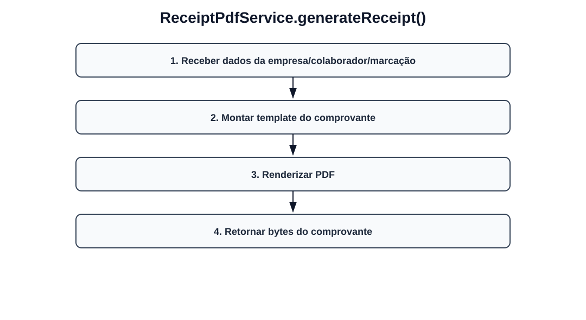

# Fluxos visuais — ReceiptPdfService

Fluxo por método com imagem dedicada para cada operação do serviço.

## `generateReceipt`

- Receber dados da empresa/colaborador/marcação.
- Montar template do comprovante.
- Renderizar PDF.
- Retornar bytes do comprovante.
