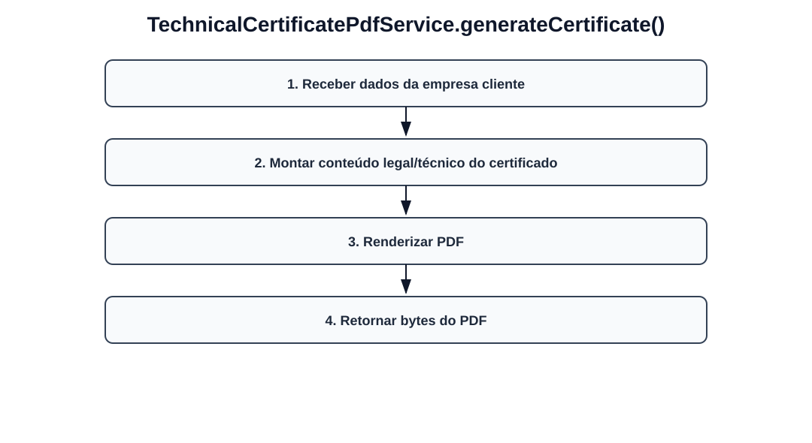

# Fluxos visuais — TechnicalCertificatePdfService

Fluxo por método com imagem dedicada para cada operação do serviço.

## `generateCertificate`

- Receber dados da empresa cliente.
- Montar conteúdo legal/técnico do certificado.
- Renderizar PDF.
- Retornar bytes do PDF.
