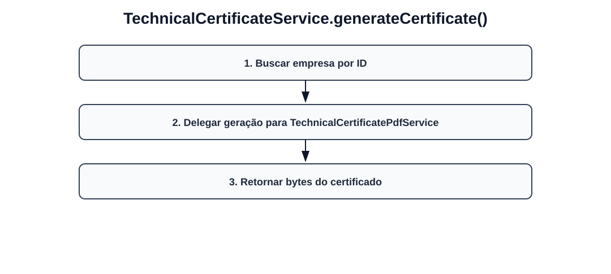

# Fluxos visuais — TechnicalCertificateService

Fluxo por método com imagem dedicada para cada operação do serviço.

## `generateCertificate`

- Buscar empresa por ID.
- Delegar geração para TechnicalCertificatePdfService.
- Retornar bytes do certificado.
