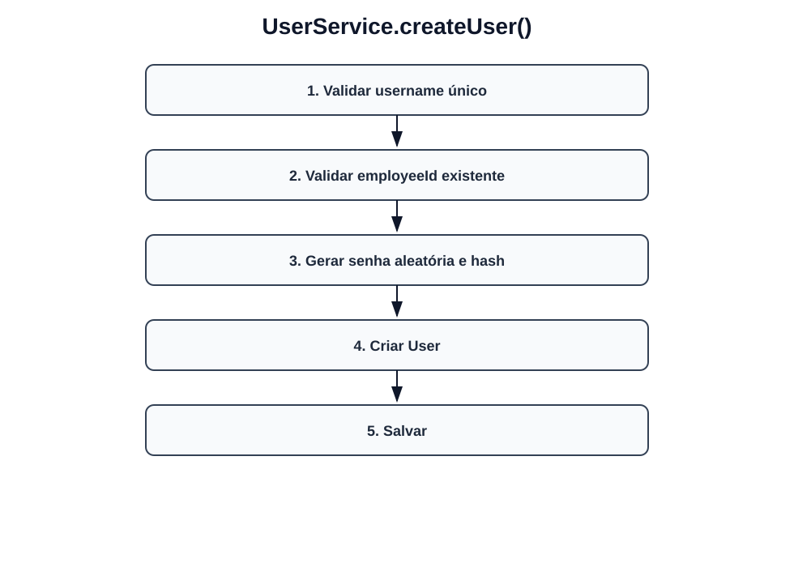
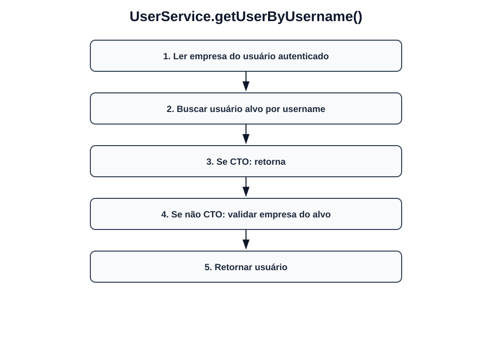
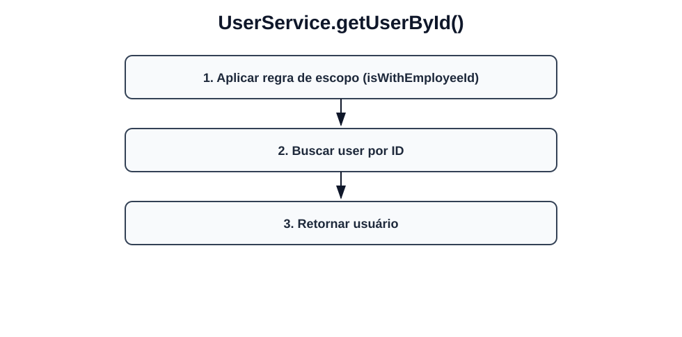
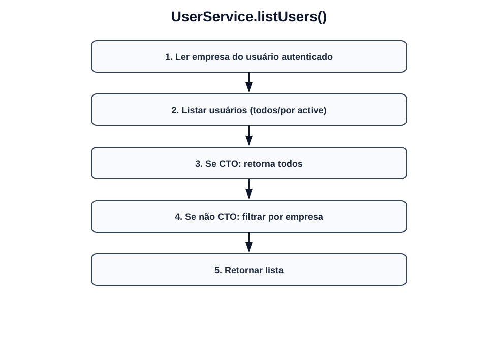
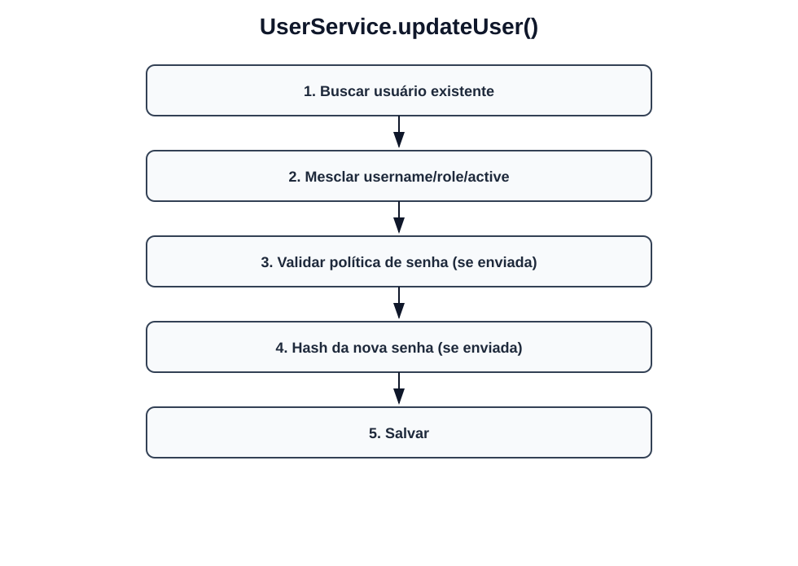
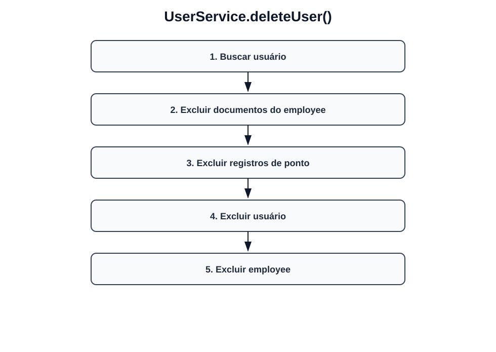
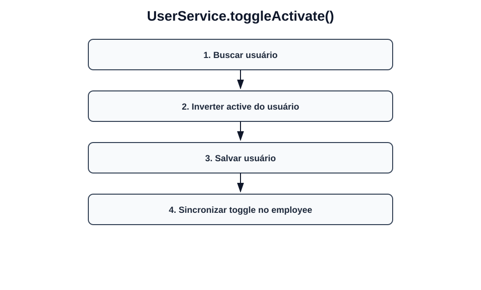
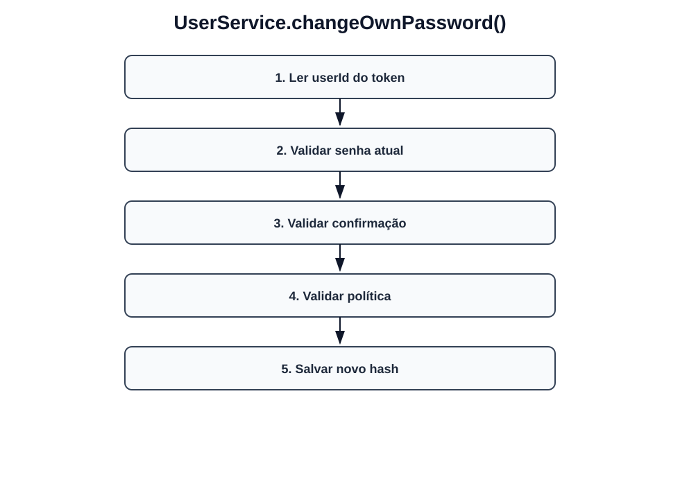
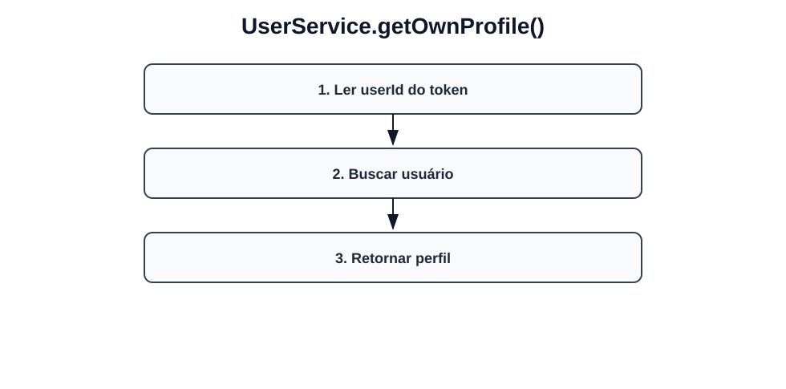
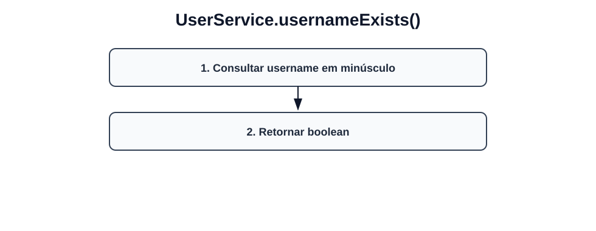

# Fluxos visuais — UserService

Fluxo por método com imagem dedicada para cada operação do serviço.

## `createUser`

- Validar username único.
- Validar employeeId existente.
- Gerar senha aleatória e hash.
- Criar User.
- Salvar.

## `getUserByUsername`

- Ler empresa do usuário autenticado.
- Buscar usuário alvo por username.
- Se CTO: retorna.
- Se não CTO: validar empresa do alvo.
- Retornar usuário.

## `getUserById`

- Aplicar regra de escopo (isWithEmployeeId).
- Buscar user por ID.
- Retornar usuário.

## `listUsers`

- Ler empresa do usuário autenticado.
- Listar usuários (todos/por active).
- Se CTO: retorna todos.
- Se não CTO: filtrar por empresa.
- Retornar lista.

## `updateUser`

- Buscar usuário existente.
- Mesclar username/role/active.
- Validar política de senha (se enviada).
- Hash da nova senha (se enviada).
- Salvar.

## `deleteUser`

- Buscar usuário.
- Excluir documentos do employee.
- Excluir registros de ponto.
- Excluir usuário.
- Excluir employee.

## `toggleActivate`

- Buscar usuário.
- Inverter active do usuário.
- Salvar usuário.
- Sincronizar toggle no employee.

## `changeOwnPassword`

- Ler userId do token.
- Validar senha atual.
- Validar confirmação.
- Validar política.
- Salvar novo hash.

## `getOwnProfile`

- Ler userId do token.
- Buscar usuário.
- Retornar perfil.

## `usernameExists`

- Consultar username em minúsculo.
- Retornar boolean.
